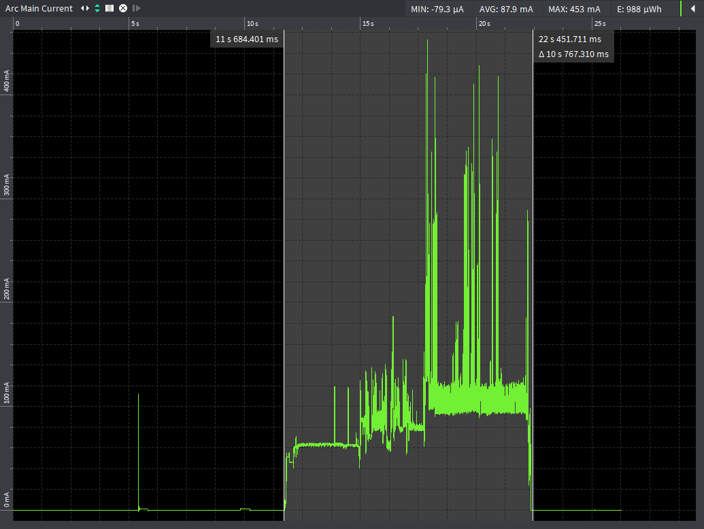
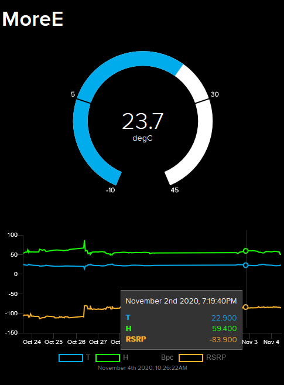

# SARA-Rx application board

 SARA-R4 NB-IoT + Cat-M1 + GNSS application board - NINA-B3 with Secure MQTT

[](https://github.com/ldab/SARA-Rx-application-board/releases/latest)
[](https://github.com/ldab/SARA-Rx-application-board/blob/master/LICENSE)

[](https://github.com/ldab/SARA-Rx-application-board)

## TODO

- [ ] More details about battery etc...
- [ ] !!! Better Socket close URC handler.
- [ ] Check AT response based on the last chars, in order to avoid missing URCs when after "OK" for example
- [ ] Implement Subscribe;


## Energy Budget

* 100mA active current;
* Code takes ~10 seconds to execute;
* Wakes every hour;
* 40uA Sleep current;
* 10 hours of light available;
* V charge ready = 3.67V;
* V Over discharge = 3.6V;
* V Over charge = 4.12V;

**Source Power Required = 4.4mW**
**Storage Required = 5.4mAh**



### Sleep Current

| Component 	| Current 	|
|-----------	|---------	|
| SARA-R410 	| 7uA     	|
| NINA-B3   	| 3uA     	|
| Batt ADC  	| 3uA     	|
| SHTC3     	| 0.5uA   	|
| TP4054    	| 1uA     	|
| TXS0108   	| 5uA(?)  	|
| TPS61021A  	| 17uA   	  |
| TOTAL     	| ~37uA   	|

## Nordic SDK

* This is based on nRF5_SDK_16.0.0_98a08e2, get yours here: https://www.nordicsemi.com/Software-and-tools/Software/nRF5-SDK/Download

## Amazon AWS and MQTT

1. Sign in to the AWS IoT Console
2. Register a Device in the Registry
3. Configure Your Device
4. View Device MQTT Messages with the AWS IoT MQTT Client

https://docs.aws.amazon.com/iot/latest/developerguide/iot-gs.html

## Running the code locally

1. Clone this repo to a local folder ```> git clone https://github.com/ldab/SARA-Rx-application-board```
2. Point the `$(SDK)` @`./code/ninab3/blank/ses/libuarte_pca10056.emProject` to where you have installed Nordic SDK, for example `C:\nRF\nRF5_SDK_16.0.0_98a08e2`
3. Like so: `macros="CMSIS_CONFIG_TOOL=C:/nRF/nRF5_SDK_16.0.0_98a08e2/external_tools/cmsisconfig/CMSIS_Configuration_Wizard.jar;SDK=C:/nRF/nRF5_SDK_16.0.0_98a08e2"`
4. Open the SEGGER Embedded Studio project file located in `./code/ninab3/blank/ses/libuarte_pca10056.emProject`

* PS. don't forget to set the NFC Pins as GPIO on the Preprocessor: `CONFIG_NFCT_PINS_AS_GPIOS`

Ref. https://devzone.nordicsemi.com/f/nordic-q-a/44638/how-to-move-an-sdk-example-out-of-the-sdk-tree

## IoT Dashboard

* Adafruit https://io.adafruit.com provides a free MQTT broker with a Dashboard allowing this project to be displayed publicly with little to no effort
  * Create an account and insert your KEY as the `MQTT_PASS`
  * `MQTT_USER` is the username used for creating the account.

* Adafruit expect data as a json, for example:

    ```
    sprintf(_msg, "{\"feeds\": {\"T\": %.01f,\"H\": %.01f,\"Bpc\": %d,\"RSRP\": %.02f,\"Bv\": %.02f}}",
            temperature, humidity, batt_lvl_in_percentage, modemInfo.RSRP, _b)
    ```

* The topic, groups and feeds are created automagically, on the example the MAC address is added as an identifier:

    ```
    sprintf(topic, "lbispo/g/nina_%X/json", NRF_FICR->DEVICEADDR[0]);
    ```

 

## Efficiency

 

## Schematic

[](./KiCad/BOM.csv)

## PCB

 

## BOM

[](./KiCad/BOM.csv)

## Enclosure

 

## Kown issues, limintations

* MQTT Socket Implementaition can only **publish** QoS 0 messages.

## Thoughts or Improvements

* Use STATUS 2 of AEM10941 as last grasp;
* Control boost converter EN, in order to turn SARA Off;
  * Remove boost converter, as it does not boost a lot since Vbatt ON = 3.6V.
* SARA RESET Pin access;
* Use 101b AEM10941 Configuration in order to Vovdis = 3.0V givin extra ~20% battery (?).
* Open Drain 74LVC3G07 buffer on NINA LED, in order to avoid leakage.

## Credits

* [MQTTBox](http://workswithweb.com/mqttbox.html) for Windows in order to communicate with the broker and check messages;
* [CloudMQTT](https://www.cloudmqtt.com/) Free Cloud Broker;
* MQTT implementation inspired and based on [knolleary PubSub Client](https://github.com/knolleary/pubsubclient);
* AT Commands implementation inspired on [vshymanskyy TinyGSM](https://github.com/vshymanskyy/TinyGSM);
* GitHub Shields and Badges created with [Shields.io](https://github.com/badges/shields/);
